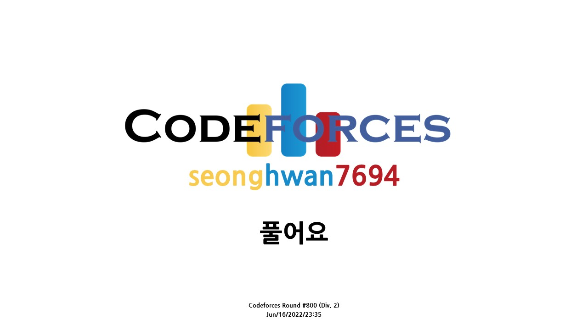

# [Codeforces Round #800 (Div. 2)](https://codeforces.com/contest/1694)


## 후기
"ㅈ댔다" 이 한 마디로 정의할 수 있겠다. 인생 첫 코드포스이자 코딩 대회였다. 개같이 썰렸다. 말이 더 이상 안 나온다. [유튜브 영상](https://www.youtube.com/watch?v=gSa3FExo7KE&t=675s)을 보면 알겠지만, A번 문제조차 풀지도 못했다. 영어로 영상 제목을 설정해뒀더니 외국인분들이 많이 들어오셨다. 덕분에 위기감도 느끼고 내가 얼마나 ㅈ밥인지 알 수 있었다. 중간에 시청자분이 "3줄 가능한데요?"라는 댓글이 올라왔을 때 헛웃음만 나오면서 방송을 끄고 싶었다. 멘탈 펑. 덕분에 내가 지금까지 공부한게 헛짓거리였다는 것을 깨달았다. 대회를 마치고, [이런 글](https://anz1217.tistory.com/147)을 만날 수 있었다. 명치를 쎄게 맞은 듯 하였다. 이 글을 되새김질하면서 초심으로 종만북과 솔브드를 풀어나갈 예정이다. 코드포스는 찢기더라도 여름방학이니 최대한 빠지지않고 전부 참가해볼 예정이다. 비록 못 풀었지만, 다른 분들의 소스를 참고해가면서 다시 풀어볼 예정이다. 6개월이 걸릴지도 모르겠다. 다시 풀고 해석을 달아 여기 README.md파일에 올리겠다. 다른 사람이 푸는 방법도 많이 찾아보고 공부할 예정이다. 나중에는 해설 영상도 찍어볼 예정이다. 오늘 1학년 1학기 종강을 했다. 그 기념으로 코드포스에 처음 참가했는데 개같이 썰렸다. 오늘 밤은 꿀잠을 잘 수 있을 것 같다. 내가 부족한 부분을 너무 쉽게 찾았기 때문이다. <br>

## [A. Creep](https://codeforces.com/contest/1694/problem/A)
```c++
#include <bits/stdc++.h>
using namespace std;
#define INF 0x7fffffff;

int test_case;
int zero, one;

int S_creepy(string str){
  int dp[202] = {0};
  if(str[0] == '0') dp[0]++;
  else dp[0]--;

  for(int i = 1; i < str.size(); i++){
    if(str[0] == '0') dp[i] = dp[i-1] + 1;
    else dp[i] = dp[i-1] - 1;
  }
  for(int i = 0; i < str.size(); i++){
    dp[i] = abs(dp[i]);
  }
  return *max_element(dp, dp + str.size());
}

int T_creepy(string str){
  int res = 0;

  for(int i = 0; i < str.size(); i++){
    if(str[i] == '0') res++;
    else res--;
  }

  return abs(res);
}
int main(){
  ios::sync_with_stdio(false);
  cin.tie(0); cout.tie(0);
  cin >> test_case;

  while(test_case--){
    cin >> zero >> one;
    int MIN_creepy = INF;
    
    string str, res;
    for(int i = 0; i < zero; i++) str += '0';
    for(int i = 0; i < one; i++) str += '1';
    int s_creepy = S_creepy(str);
    
    do{
      int t_creepy = T_creepy(str);
      if(MIN_creepy > t_creepy and s_creepy >= t_creepy){
        res = str;
        MIN_creepy = t_creepy;
      }
    }while(next_permutation(str.begin(), str.end()));
    cout << res << "\n";
  }

  return 0;
}
```
## [B. Paranoid String](https://codeforces.com/contest/1694/problem/B)
```c++
#include <bits/stdc++.h>
using namespace std;

int main(){
  ios::sync_with_stdio(false);
  cin.tie(0); cout.tie(0);

  return 0;
}
```
## [C. Directional Increase](https://codeforces.com/contest/1694/problem/C)
```c++
#include <bits/stdc++.h>
using namespace std;

int main(){
  ios::sync_with_stdio(false);
  cin.tie(0); cout.tie(0);

  return 0;
}
```
## [D. Fake Plastic Trees](https://codeforces.com/contest/1694/problem/D)
```c++
#include <bits/stdc++.h>
using namespace std;

int main(){
  ios::sync_with_stdio(false);
  cin.tie(0); cout.tie(0);

  return 0;
}
```
## [E. Keshi in Search of AmShZ](https://codeforces.com/contest/1694/problem/E)
```c++
#include <bits/stdc++.h>
using namespace std;

int main(){
  ios::sync_with_stdio(false);
  cin.tie(0); cout.tie(0);

  return 0;
}
```
## [F. Decinc Dividing](https://codeforces.com/contest/1694/problem/F)
```c++
#include <bits/stdc++.h>
using namespace std;

int main(){
  ios::sync_with_stdio(false);
  cin.tie(0); cout.tie(0);

  return 0;
}
```


