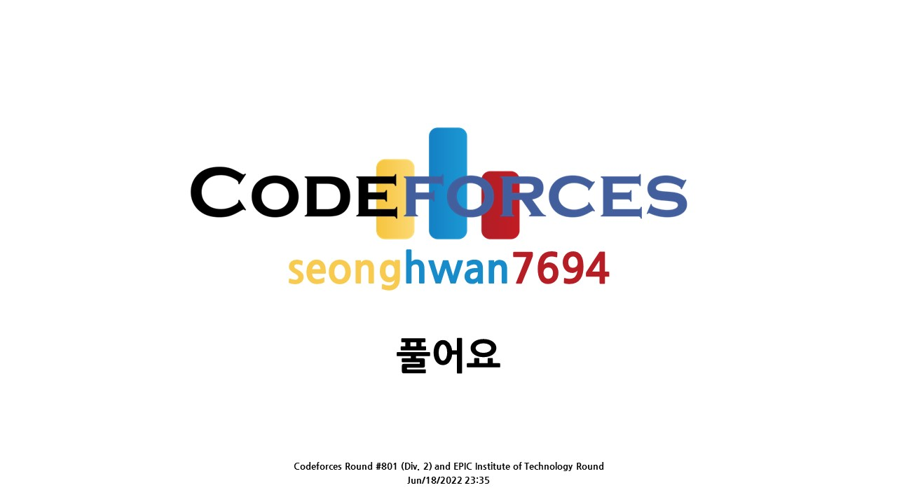

# [Codeforces Round #801](https://codeforces.com/contest/1695)


## 후기
"아 드디어 1문제 풀었다"로 요약하겠다. 영어 읽는 게 버거워서 문제를 이해하기에 오랜 시간이 걸렸다. 이 부분에 대한 노력이 정말 많이 되어야 한다고 생각한다. 백준 문제와 달리 상황극을 좋아하는 것 같다. 주어진 문제를 추상화하고 구현하는 건 언제나 프로그래머의 작업이니까 말이다. <br>

## [A. Subrectangle Guess](https://codeforces.com/contest/1695/problem/A)
```c++
#include <bits/stdc++.h>
using namespace std;

// 문제를 이해 못해서 못 푸는.... 이제 이해했다...! 아마도?


// 미첼은 h, w를 말해
// 조는 h * w 크기의 하위사각형을 골라. n * m 크기의 사각형 안에 있음을 보장해
// 마지막으로 미첼은 하위사각형 안에 최대 수를 추측해야해

// 미첼은 큰 숫자를 좋아하지 않아서, 하위사각형의 면적을 최대한 작게 만들면서
// "조의 선택에 따라 승리하는 것이 아니라" 승리하는 것을 "항상" "보장"받길 원해.
// 가능한 지역 중 그 넓이가 최소인 지역을 찾아라?

int test_case;
int board[41][41]; // 1_indexed
int n, m, w, h; // h, w는 최대인 값의 위치이다.

#define min_INF -0x7fffffff;
int Max;

int main(){
  ios::sync_with_stdio(false);
  cin.tie(0); cout.tie(0);

  cin >> test_case;
  while(test_case--){
    cin >> n >> m;
    Max = min_INF;
    for(int i = 1; i <= n; i++){
      for(int j = 1; j <= m; j++){
        cin >> board[i][j];
        if(Max < board[i][j]){ w = i; h = j; Max = board[i][j]; }
      }
    }
    // cout << w << " " << h << "\n";
    // cout << "tc\n";
    // cout << "w*h : " << w*h << "\n";
    // cout << "w*(m-h+1) : " << w*(m-h+1) << "\n";
    // cout << "(n-w+1)*h : " << (n-w+1)*h << "\n";
    // cout << "(n-w+1)*(m-h+1) : " << (n-w+1)*(m-h+1) << "\n";
    int arr[4] = {w*h, w*(m-h+1), (n-w+1)*h, (n-w+1)*(m-h+1)};
    cout << *max_element(arr, arr + 4) << "\n";
    // 1_indexed..
    // 1 번 구간 x : [1, w] y : [1, h] (w-1+1)*(h-1+1) = w*h
    // 2 번 구간 x : [1, w] y : [h, m] (w-1+1)*(m-h+1) = w*(m-j+1)
    // 3 번 구간 x : [w, n] y : [1, h] (n-w+1)*(h-1+1) = (n-w+1)*h
    // 4 번 구간 x : [w, n] y : [h, m] (n-w+1)*(m-h+1) = (n-w+1)*(m-h+1)
  }
  return 0;
}
```
## [B. Circle Game](https://codeforces.com/contest/1695/problem/B)
```c++
#include <bits/stdc++.h>
using namespace std;

int main(){
  ios::sync_with_stdio(false);
  cin.tie(0); cout.tie(0);

  return 0;
}
```
## [C. Zero Path](https://codeforces.com/contest/1695/problem/C)
```c++
#include <bits/stdc++.h>
using namespace std;

// ㅆㅓㅁㄴㅔㅇㅣㄹ ㅋㅡㄱㅣ ㅎㅗㅏㄱㅇㅣㄴ

int test_case;
int board[1010][1010];
int n, m;
int dx[2] = {1, 0};
int dy[2] = {0, 1};
bool flag = false;
/* 큐때문에 메모리 초과 뜨는 것 같음
void solution(){
  queue<pair<int, pair<int, int>>> q; //  {cur_sum, {cur_x, cur_y}};
  while(!q.empty()){
    q.pop();
  }
  q.push({board[0][0], {0, 0}}); // sum = 0, x = 0, y = 0

  while(!q.empty()){
    auto cur = q.front(); q.pop();
    if(cur.second.first == n - 1 and cur.second.second == m - 1 and cur.first == 0){
      cout << "YES" << "\n";
      
      return;
    }
    for(int dir = 0; dir < 2; dir++){
      int n_x = cur.second.first+ dx[dir];
      int n_y = cur.second.second + dy[dir];
      int n_sum = cur.first + board[n_x][n_y];
      if(n_x >= n or n_y >= m) continue;
      q.push({n_sum, {n_x, n_y}});
    }
  }
  cout << "NO" << "\n";
  return;
}
*/


// dfs 잘 못 짜는데.. 하... 이 새낀 시간초과...

/*
void dfs(int sum, int x, int y){
  if(flag) return; // 시간초과 예방 가능? -> 불가능 ~

  if(x == n - 1 and y == m - 1 and sum == 0){
    flag = true;
    return;
  }
  if(x+1 < n) dfs(sum + board[x+1][y], x+1, y);
  if(y+1 < m) dfs(sum + board[x][y+1], x, y+1);
  return;
}

void solution(){
  flag = false;
  dfs(board[0][0], 0, 0);
  if(flag) cout << "YES\n";
  else cout << "NO\n";
}
*/

int main(){
  ios::sync_with_stdio(false);
  cin.tie(0); cout.tie(0);

  cin >> test_case;
  while(test_case--){
    cin >> n >> m;
    for(int i = 0; i < n; i++){
      for(int j = 0; j < m; j++){
        cin >> board[i][j];
      }
    }
    solution();
  }
  return 0;
}
```
## [D1. Tree Queries (Easy Version)](https://codeforces.com/contest/1695/problem/D1)
```c++
#include <bits/stdc++.h>
using namespace std;

int main(){
  ios::sync_with_stdio(false);
  cin.tie(0); cout.tie(0);

  return 0;
}
```
## [D2. Tree Queries (Hard Version)](https://codeforces.com/contest/1695/problem/D2)
```c++
#include <bits/stdc++.h>
using namespace std;

int main(){
  ios::sync_with_stdio(false);
  cin.tie(0); cout.tie(0);

  return 0;
}
```
## [E. Ambiguous Dominoes](https://codeforces.com/contest/1695/problem/E)
```c++
#include <bits/stdc++.h>
using namespace std;

int main(){
  ios::sync_with_stdio(false);
  cin.tie(0); cout.tie(0);

  return 0;
}
```


