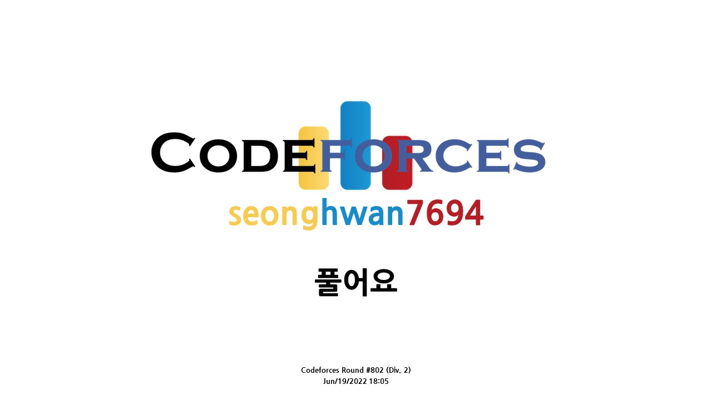

# [Codeforces Round #802](https://codeforces.com/contest/1700)


## 후기
문제를 풀기전에 어떤 알고리즘과 자료구조를 사용하여 구현해낼 것인지 고민하고 구현을 시작해야함을 깨달을 수 있었습니다. A번 문제를 처음 풀었을 떄는 기쁜 마음으로 인접 행렬 + BFS로 풀었습니다. 하지만, 메모리 초과가 나왔습니다. 256Mb가 메모리 제한인데 262Mb가 나왔습니다. 돌아와서 인접 행렬 + 그리디로 풀었으나 역시 시간초과가 나왔습니다. 이때 인접 행렬을 문제에서 주어진 표현 `aij=(i−1)⋅m+j`으로 표현할 수 있다는 것을 깨닫고 오로지 그리디로만 푸는데 성공했습니다. 교훈을 많이 주는 문제입니다. 그동안 문제 태그를 켜놓고 푼 것에 대한 악영향이겠죠. 오늘은 중간에 저녁을 먹어야해서 급히 라이브를 중단하였습니다. 감사합니다. <br>

## [A. Optimal Path](https://codeforces.com/contest/1700/problem/A)
```c++
#include <bits/stdc++.h>
using namespace std;
#define ll long long
#define X first
#define Y second
 
int test_case;
// ll board[10001][10001]; // 1-indexed로 처리합니다 ( 문제의 컨벤션을 그대로 )
int N, M;

// 문제 맥시멈 :          500099995000
// 내 맥시멈 :     1883788664
/*
규칙이 있지 않을까?
 
- 가설 1 (BFS)
(1, 1)에서 시작해서 (n, m)으로 가는 게 목표이다.
매 순간 작은 선택을 한다?
구현에 성공했지만 262MB로 주어진 메모리 제한(256)을 넘어섬.

- 가설 2 (그리디)
구현

// 오버플로우 왜 뜨는거지 -> 찾았다;;
*/

/* BFS로 구현한 솔루션
void solution(){
  queue<pair<ll , pair<int, int>>> q;
 
  q.push({board[1][1], {1, 1}}); // {cur_sum, {cur_x, cur_y}}
  while(!q.empty()){
    auto cur = q.front(); q.pop();
    int cur_x = cur.second.X;
    int cur_y = cur.second.Y;
    ll cur_sum = cur.first;
    if(cur_x == N and cur_y == M){
     cout << cur_sum << "\n";
     return;
    }
    vector<pair<ll , pair<int, int>>> nxt_cost;
    if(cur_x + 1 <= N) nxt_cost.push_back({cur_sum + board[cur_x + 1][cur_y],{cur_x + 1, cur_y}});
    if(cur_y + 1 <= M) nxt_cost.push_back({cur_sum + board[cur_x][cur_y + 1], {cur_x, cur_y + 1}});
    if(!nxt_cost.empty()){ // 비어있지 않았으면 최소의 비용을 선택하고 큐에 넣어줌
      q.push(*min_element(nxt_cost.begin(), nxt_cost.end()));
    }
  }
  return;
}
*/

/*
void solution(){
  
  ll tmp[10001][10001] = {0};
  tmp[1][1] = board[1][1];
  int i = 1, j = 1;
    
  while(!tmp[N][M]){
    if( i + 1 <= N and j + 1 <= M){
      if(min(tmp[i][j+1], tmp[i+1][j]) == tmp[i][j+1]){
        tmp[i][j] = tmp[i][j] + board[i][++j]; 
      }else{
        tmp[i][j] = tmp[i][j] + board[++i][j];
      }
    }else if(i + 1 <= N){
      tmp[i][j] += tmp[i][j] + board[++i][j];
    }else if(j + 1 <= M){
      tmp[i][j] += tmp[i][j] + board[i][++j];
    }
  }
  

  // 인덱스 범위 넘어가는거 예외처리..

  
  ll sum = 0, temp;
  while(!tmp[N][M]){
  sum += (temp = min(board[i][j+1], board[i+1][j]));
    if(temp == board[i][j+1]){
      tmp[i][++j] = sum;
    }
    else{
      tmp[++i][j] = sum;
    }
  }
  cout << sum;
}
*/


void solution(){
  ll sum = 1;
  for(int j = 2, i = 1; j <= M; j++){
    sum += (i - 1)*M+j;
  }
  for(int i = 2, j = M; i <= N; i++){
    sum += (i - 1)*M+j;
  }
  cout << sum << "\n";
}
int main(){
  ios::sync_with_stdio(false);
  cout.tie(0); cin.tie(0);
 
  cin >> test_case;
  while(test_case--){
    cin >> N >> M;
    /*
    ll cnt = 1;
    for(int i = 1; i <= N; i++){
      for(int j = 1; j <= M; j++){
        board[i][j] = cnt++;
      }
    }
    */
    solution();
  }
  return 0;
}
```
## [B. Palindromic Numbers](https://codeforces.com/contest/1695/problem/B)
```c++
#include <bits/stdc++.h>
using namespace std;

int main(){
  ios::sync_with_stdio(false);
  cin.tie(0); cout.tie(0);

  return 0;
}
```
## [C. Helping the Nature](https://codeforces.com/contest/1695/problem/C)
```c++
#include <bits/stdc++.h>
using namespace std;

int main(){
  ios::sync_with_stdio(false);
  cin.tie(0); cout.tie(0);

  return 0;
}
```
## [D. River Locks](https://codeforces.com/contest/1700/problem/D)
```c++
#include <bits/stdc++.h>
using namespace std;

int main(){
  ios::sync_with_stdio(false);
  cin.tie(0); cout.tie(0);

  return 0;
}
```
## [D2. Tree Queries (Hard Version)](https://codeforces.com/contest/1700/problem/E)
```c++
#include <bits/stdc++.h>
using namespace std;

int main(){
  ios::sync_with_stdio(false);
  cin.tie(0); cout.tie(0);

  return 0;
}
```
## [F. Puzzle](https://codeforces.com/contest/1700/problem/F)
```c++
#include <bits/stdc++.h>
using namespace std;

int main(){
  ios::sync_with_stdio(false);
  cin.tie(0); cout.tie(0);

  return 0;
}
```


