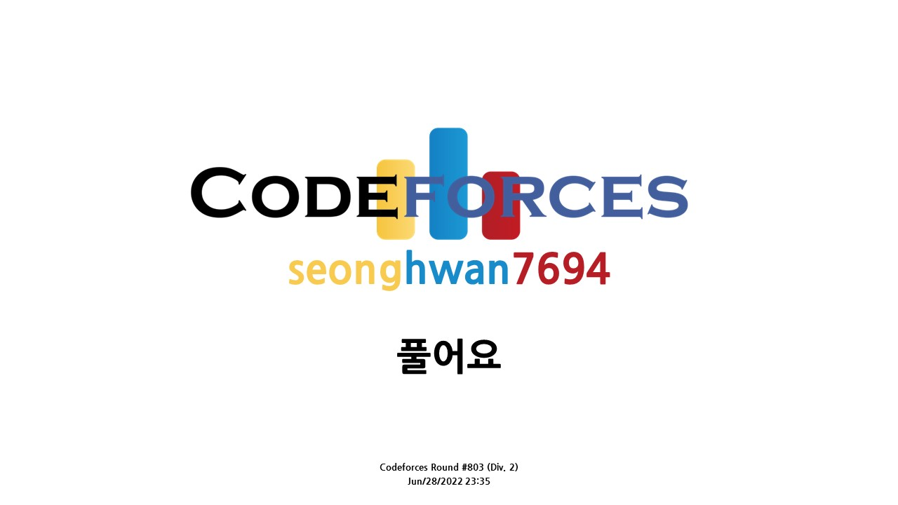

# [Codeforces Round #802](https://codeforces.com/contest/1698)


## 후기
 <br>

## [A. XOR Mixup](https://codeforces.com/contest/1698/problem/A)
```c++
#include <bits/stdc++.h>
using namespace std;
int tc, n;
int arr[101];

int get_XOR(int x){
  int res = 0;
  bool flag = true;
  for(int i = 0; i < n; i++){
    if(i == x) continue;
    if(flag){
      res = arr[i];
      flag = false;
      continue;
    }
    res = res^arr[i];
  }
  return res;
}
int main(){
  ios::sync_with_stdio(false);
  cin.tie(0); cout.tie(0);

  cin >> tc;
  while(tc--){
    cin >> n;
    for(int i = 0; i < n; i++){
      cin >> arr[i]; 
    }
    for(int i = 0; i < n; i++){
      if(arr[i] == get_XOR(i)){
        cout << arr[i] << "\n";
        break;
      }
    }
  }
  return 0;
}

```
## [B. Rising Sand](https://codeforces.com/contest/1698/problem/B)
```c++
#include <bits/stdc++.h>
using namespace std;

int tc, n, k;
vector<int> a;

int main(){
  ios::sync_with_stdio(false);
  cin.tie(0); cout.tie(0);

  cin >> tc;
  while(tc--){
    cin >> n >> k;
    for(int i = 0, tmp; i < n; i++){
      cin >> tmp;
      a.push_back(tmp);
    }
    int ans = 0;
    for(int i = 1; i < a.size() - 1; i++){
      if(a[i] > a[i-1] + a[i+1]){
        
      }
    }
    cout << ans << "\n";
  }

  return 0;
}
```
## [C. 3SUM Closure](https://codeforces.com/contest/1698/problem/C)
```c++
#include <bits/stdc++.h>
using namespace std;
// 인트 오버플로우 주의
#define ll long long
int tc, n;


void solution(){
  vector<ll> arr;
  cin >> n;
  for(int i = 0, tmp; i < n; i++){
    cin >> tmp;
    arr.push_back(tmp);
  }
  sort(arr.begin(), arr.end());
  int st = 0, en = n - 1;
  for(int i = 0; i < n; i++){
    int cnt = 0;
    if(arr[i] == 0){
      for(int j = i; j < i + 3; j++){
        if(arr[j] == 0) cnt++;
      }
      if(cnt == 3){
        cout << "YES" << "\n";
        return;
      }
    }
  }
  while(st < en){
    auto iter = lower_bound(arr.begin(), arr.end(), arr[st] + arr[en]);
    // arr[st] + arr[en] == 0
    // arr[st] + arr[iter - arr.begin()] == 0
    // arr[st]  + arr[iter - arr.begin()] == 0
    if((!(arr[st] + arr[en]) or !(arr[st] + arr[iter - arr.begin()]) or !(arr[en] + arr[iter - arr.begin()])) and st != iter - arr.begin() and en != iter - arr.begin()){
      cout << st << en << iter - arr.begin() << "\n";
      cout << arr[st] << " " << arr[en] << " " << arr[iter - arr.begin()] << "\n";
      cout << "YES" << "\n";
      return;
    }else if(arr[st] + arr[en] < 0){
      st++;
    }else{
      en--;
    }
  }
  cout << "NO" << "\n";
  return;
}
int main(){
  ios::sync_with_stdio(false);
  cin.tie(0);
  cout.tie(0);

  cin >> tc;
  while(tc--){
    solution();
  }

  return 0;
}
```
## [D. Fixed Point Guessing](https://codeforces.com/contest/1698/problem/D)
```c++
#include <bits/stdc++.h>
using namespace std;

int main(){
  ios::sync_with_stdio(false);
  cin.tie(0); cout.tie(0);

  return 0;
}
```
## [E. PermutationForces II](https://codeforces.com/contest/1698/problem/E)
```c++
#include <bits/stdc++.h>
using namespace std;

int main(){
  ios::sync_with_stdio(false);
  cin.tie(0); cout.tie(0);

  return 0;
}
```
## [F. Equal Reversal](https://codeforces.com/contest/1698/problem/F)
```c++
#include <bits/stdc++.h>
using namespace std;

int main(){
  ios::sync_with_stdio(false);
  cin.tie(0); cout.tie(0);

  return 0;
}
```
## [G. Long Binary String](https://codeforces.com/contest/1698/problem/G)
```c++
#include <bits/stdc++.h>
using namespace std;

int main(){
  ios::sync_with_stdio(false);
  cin.tie(0); cout.tie(0);

  return 0;
}
```


