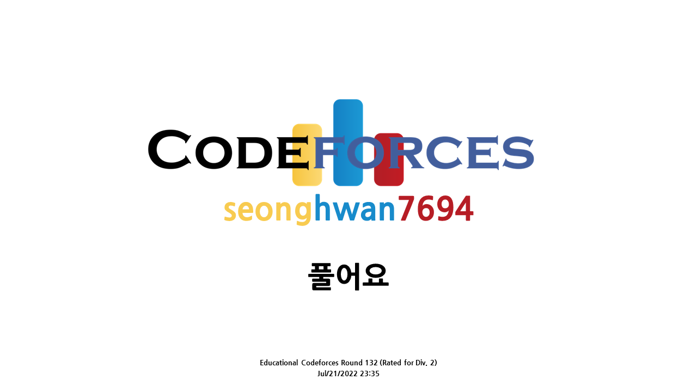

# [Educational Codeforces Round 132 (Rated for Div. 2)](https://codeforces.com/contest/1709)

## 후기
A번은 정말 무난하게 풀었는데, B와 C가 문제였습니다. B는 누적합을 적용해야 TLE 나지 않는다는걸 직감했지만, 귀찮아서(그리고 혹시나해서) 완전탐색 돌렸더니 역시 TLE이 뜨네요... for문의 리미트를 잘못 설정해줘서 계속 뻘짓하다가 ^^ 결국은 누적합으로 구현하고 자잘한 오류 고쳤더니 AC.... C는 TLE 때문에 빡치네요. 백트래킹으로 '?'로 된 부분 괄호로 채워주고 괄호쌍 검사를 실시하는데... 테스트케이스가 5 * 10^4, 최대 문자열 길이가 2 * 10^5 입니다... 시간 제한은 2초이고요. '완전탐색을 긁는다'라는 표현을 들어본 적 있는데 그 의미를 정확하게 깨달을 수 있었습니다 ^^. 당연히 틀렸구요. B번 맞은 사람이 1.1만인데 C번 맞은 사람은 0.1만이네요 ㅋㅋㅋㅋㅋㅋㅋㅋㅋㅋㅋㅋㅋㅋㅋㅋㅋㅋㅋㅋㅋㅋ 